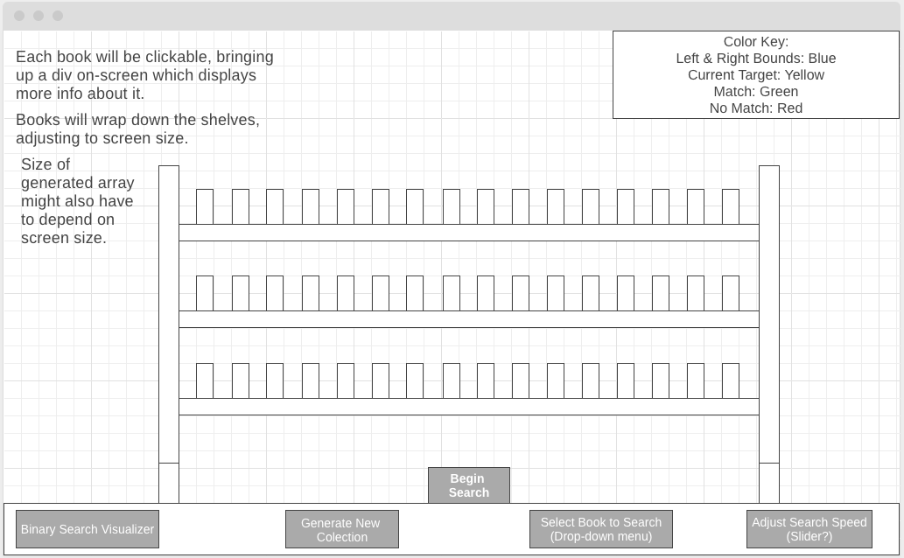
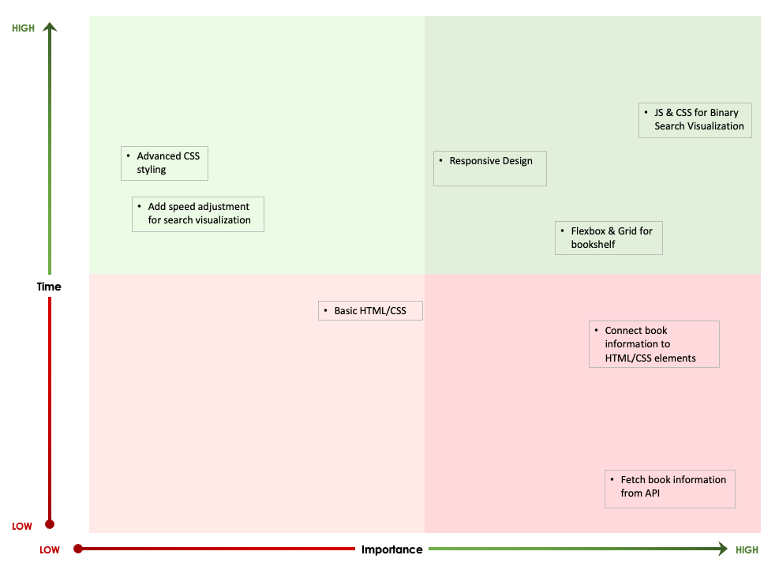

# Project Overview

## Project Name

The Bookcase: Binary Search Visualization

## Project Description

Users can generate a random collection of books that are then arranged on a virtual bookshelf. Users can select a specific title to see how the binary search algorithm locates a specific book on the shelf. While the search runs, values tracked within the algorithm are highlighted, including the left and right bounds and current target.

Additionally, clicking on a book will allow users to view additional information or follow a link back to Open Library to learn more.

## API and Data Sample

[Open Library API](https://openlibrary.org/developers/api)

```
{
            "cover_i": 8600440,
            "has_fulltext": false,
            "title": "Horror Masters Vol. 5",
            "title_suggest": "Horror Masters Vol. 5",
            "type": "work",
            "ebook_count_i": 0,
            "edition_count": 1,
            "key": "/works/OL19799843W",
            "last_modified_i": 1561320169,
            "cover_edition_key": "OL27011325M",
            "first_publish_year": 2010,
            "author_name": [
                "Sons of Horror"
            ],
            "publish_year": [
                2010
            ],
            "author_key": [
                "OL7553344A"
            ],
            "seed": [
                "/books/OL27011325M",
                "/works/OL19799843W",
                "/authors/OL7553344A"
            ],
            "isbn": [
                "161704041X",
                "9781617040412"
            ],
            "edition_key": [
                "OL27011325M"
            ],
            "publisher": [
                "River Styx Publishing"
            ],
            "text": [
                "OL27011325M",
                "161704041X",
                "9781617040412",
                "Sons of Horror",
                "OL7553344A",
                "Horror Masters Vol. 5",
                "/works/OL19799843W",
                "River Styx Publishing"
            ],
            "publish_date": [
                "Jan 05, 2010"
            ]
        },
```

## Wireframe



## MVP/PostMVPs

#### MVP 

- Generate a random collection of books.
- Click on a book on the shelf to view additional information.
- Click button to run a visual binary search for a title somewhere in the collection.
- Ability to adjust speed of search
- Keep track of variables in serach algoritm

#### PostMVP  

- Add a linear search option for comparision.
- Add more advanced CSS animations.
- Consider Goodreads API for extra functionality. 

## Project Schedule

|  Day | Deliverable | Status
|---|---| ---|
|Dec 18| Prompt / Wireframes / Priority Matrix / Timeframes / API Access | Completed
|Dec 21| Project Approval | Completed
|Dec 22| Core Application Structure: Basic page layout, code for book generation, basic code for binary search | Completed
|Dec 23| Pseudocode / code for generating collection on click, selecting book to be searched in dropdown| Completed
|Dec 28| Pseudocode / code for highlighting book and accessing additional information | Completed
|Dec 30| JS and CSS for visualizing binary search | Completed
|Jan 3| Additional CSS / PMVP if applicable | Completed
|Jan 4| MVP | Completed
|Jan 5| Presentations | Incomplete

## Priority Matrix



## Timeframes

| Component | Priority | Estimated Time | Time Invested | Actual Time |
| --- | :---: |  :---: | :---: | :---: |
| Basic HTML/CSS| L | 1hr| 1hr | 1hr |
| Fetch info from API | H | 1hr| 1hr | 1hr  |
| Grid and design for bookshelf | H | 3hrs | 4hrs | 4hrs |
| Connect API info and HTML elements| H | 3hrs | 3hrs | 3hrs |
| JS for generating books | H | 2hrs | 2hrs | 2hrs |
| JS for User inputs | H | 3hrs | 5hrs | 5hrs |
| MVP CSS | H | 3hr| 8hrss  | 8hrs |
| Responsive design | M | 3hrs | 5hrs | 5hrs |
| Basic JS for BS search| H | 3hrs | 5hrs |  5hrs |
| Basic CSS for BS search| H | 3hrs | 3hrs | 3hrs |
| Speed adjustment for BS search| L | 3hrs | 2hrs | 2hrs |
| Advanced CSS styling| L | 3hrs | 10hrs | 10hrs |
| General QA/debugging | H | 5hrs | 5hrs | 5hrs |
| Total | H | 40hrs | 54hrs | 54hrs |

## Code Snippet
Below is the code used to visualize the binary search. The most difficult section of the project was manipulating the base algoritm to visualize what the algorithm is doing.
```
const sleep = (delay) => new Promise((resolve) => setTimeout(resolve, delay));

function binarySearch(array, target) {
    return binarySearchHelper(array, target, 0, array.length - 1);
}

async function binarySearchHelper(array, target, left, right) {
    while (left <= right) {
        const mid = Math.floor((left + right) / 2);
        const potentialMatch = array[mid];
        let leftBook = document.querySelector(`#i${array[left]}`);
        let rightBook = document.querySelector(`#i${array[right]}`);
        let potentialBook = document.querySelector(`#i${array[mid]}`);
        let speed = selectSpeed();
        document.querySelector('.midpoint').textContent = ``;
        document.querySelector('.low').textContent = `${left}`;
        document.querySelector('.high').textContent = `${right}`;
        leftBook.classList.add('leftBound');
        rightBook.classList.add('rightBound');
        await sleep(speed);
        potentialBook.classList.add('mid');
        document.querySelector('.midpoint').textContent = `${mid}`;
        if (target === potentialMatch) {
          await sleep(500)
          leftBook.classList.remove('leftBound');
          rightBook.classList.remove('rightBound');
          potentialBook.classList.remove('mid');
          removeRight(mid);
          removeLeft(mid);
          potentialBook.classList.add('match');
          await sleep(speed);
          potentialBook.classList.remove('match');
          reset(subjectArray);
          return mid;
        } else if (target < potentialMatch) {
          await sleep(speed);
          rightBook.classList.remove('rightBound');
          right = mid - 1;
          removeRight(right);
          potentialBook.classList.remove('mid');
        } else {
          await sleep(speed);
          leftBook.classList.remove('leftBound');
          left = mid + 1;
          removeLeft(left);
          potentialBook.classList.remove('mid');
        }
    }
    document.querySelector('.button').textContent = 'NO MATCH';
    await sleep(1000);
    reset(subjectArray);
    document.querySelector('.button').textContent = 'Start Search';
    return -1;
}
```
## Change Log
```
	W.I.P.
```
